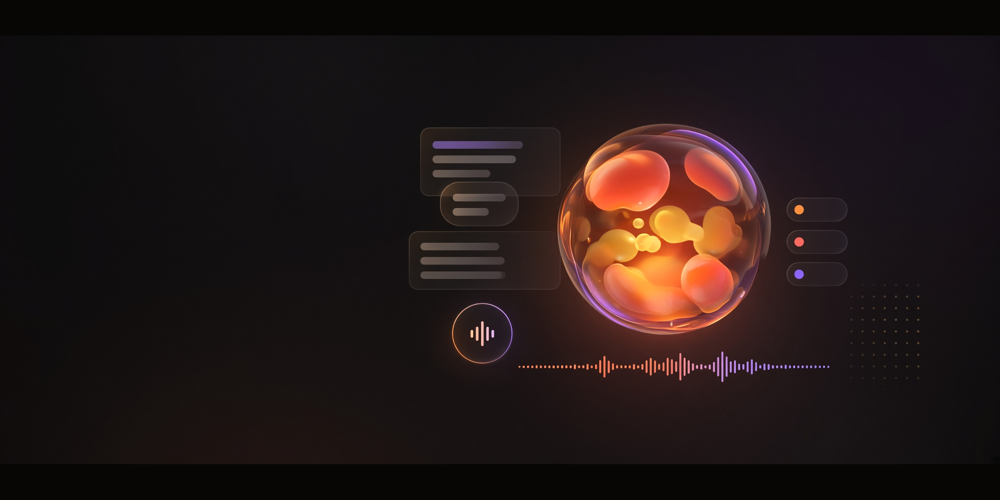
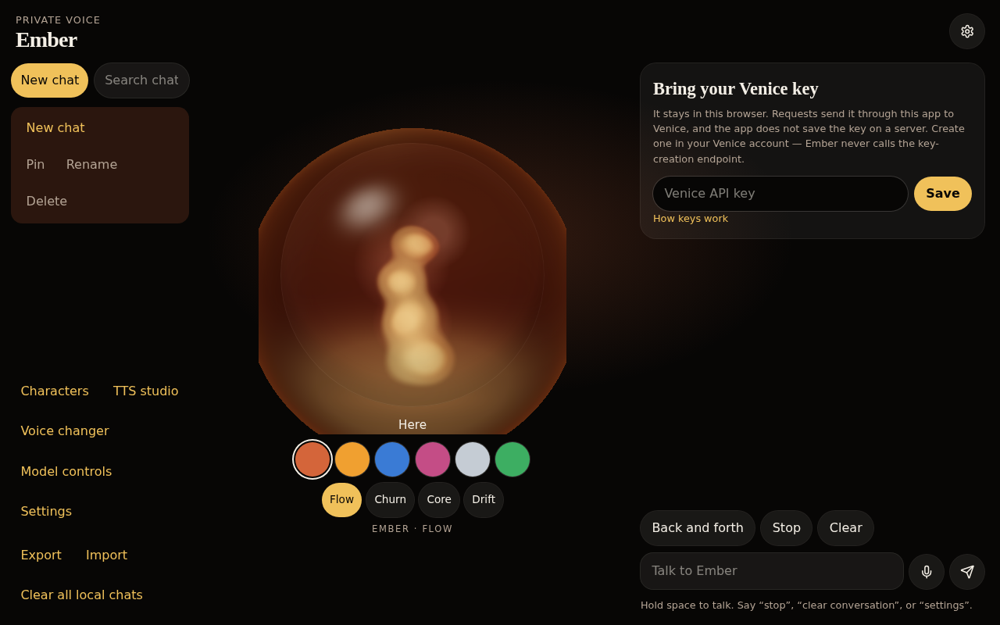
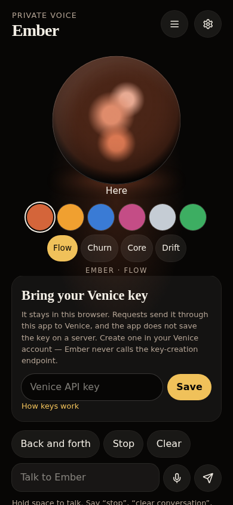
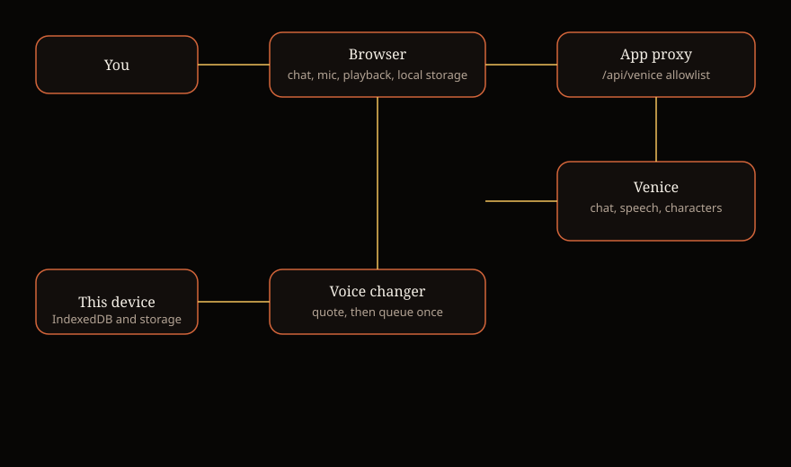
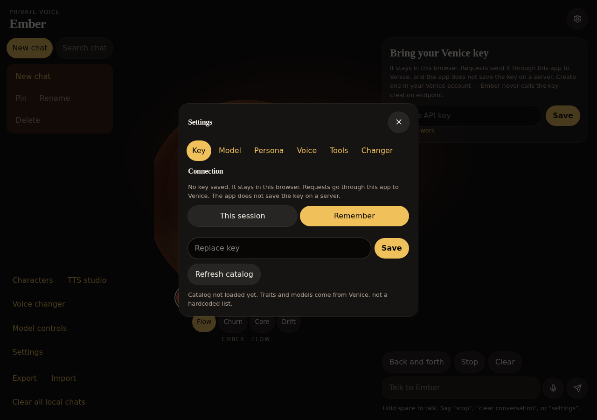

# Ember

Venice-powered voice and chat in the browser. You bring an inference key, pick models and a voice from your Venice account, and talk or type. Ember does not train model weights and does not create API keys.

[](https://github.com/spearchucker667/Venice-TTS-bot/actions/workflows/ci.yml)
[](https://github.com/spearchucker667/Venice-TTS-bot/actions/workflows/docs.yml)
[](https://github.com/spearchucker667/Venice-TTS-bot/actions/workflows/codeql.yml)
[](https://github.com/spearchucker667/Venice-TTS-bot/actions/workflows/scorecard.yml)
[](LICENSE)
[](package.json)



---

## What it does

- **Streamed Voice & Text Chat:** Low-latency Venice streaming chat with full markdown rendering, system prompts, and Venice character persona integration.
- **Hands-Free Speech Pipeline:** Real-time Voice Activity Detection (VAD) with ambient noise microphone calibration, timestamp hysteresis, and streaming text-to-speech starting at sentence boundaries.
- **7 Vessel Orb Forms:** Interactive animated lamps (Sphere, Torus, Prism, Wave, Morph, Flame, Crystal) powered by WebGL Signed Distance Field (SDF) shaders, mouse/touch spring physics, and real-time audio reactivity.
- **8 Semantic Theme Families:** Complete dual light/dark mode palettes (Ember, Obsidian, Crimson, Cyberpunk, Forest, Lavender, Midnight, Paper) with zero flash of unstyled theme (pre-hydration bootstrap).
- **Voice Changer:** Dedicated Venice speech-to-speech audio conversion pipeline with quote generation, single-item queueing, progress polling, and playback.
- **Reusable Profiles:** Create, save, and switch between custom voice, persona, and generation profiles with inline chat badges.
- **Workspace Portability:** Export and import entire conversation histories and settings with schema validation and atomic writes.
- **In-App Diagnostics:** Telemetry modal tracking Web Audio context state, microphone input latency, and Venice API catalog health.
- **Message Branching:** Fork and replay alternative conversation branches at any turn.
- **Local BYOK Privacy:** Venice API keys and conversation histories remain strictly inside your browser (`localStorage` / `sessionStorage` / `IndexedDB`). The server proxy never persists keys or logs tokens.





---

## Voice, in one pass

```text
typed text ─────────────────────────────┐
microphone audio → Venice transcription ┤
                                        ↓
                                 Venice chat
                                        ↓
                               streamed reply text
                                        ↓
                         Venice speech → speakers
```

Voice Changer does not go through the chat model. It sends the audio file to Venice's speech-to-speech queue after a quote. Details: [docs/VOICE_MODES.md](docs/VOICE_MODES.md).



---

## Quickstart

Requires Node 22.

```bash
npm ci
npm run dev
```

1. Open the application at `http://127.0.0.1:8080/`.
2. Paste a Venice inference key from your Venice AI account.
3. Choose **This session** (stored in `sessionStorage` only) or **Remember** (`localStorage`).
4. Select a model and voice, or pick a community character persona.

The key is sent as `Authorization: Bearer` to the local `/api/venice` proxy, which forwards it to `https://api.venice.ai/api/v1`. The proxy does not persist or log the key. Full setup guide: [docs/QUICKSTART.md](docs/QUICKSTART.md).

---

## Settings & configuration

The gear icon opens configuration across:

- **Key:** Key mode (session vs remember) and catalog cache synchronization.
- **Model:** Venice model selection, generation presets (creative, balanced, precise), temperature, top P, max tokens, and penalty controls.
- **Persona:** Custom system instructions and Venice character persona selection.
- **Voice:** TTS model, voice selector, playback speed, and sentence-level audio streaming.
- **Tools:** Browser HTTP tool with scoped integrations and private network filtering.
- **Changer:** Venice speech-to-speech voice changer configuration.
- **Profiles:** Save and switch between named parameter presets.
- **Appearance:** 8 theme families, dark / light / system mode, and 7 vessel orb forms.



Detailed configuration reference: [docs/CONFIGURATION.md](docs/CONFIGURATION.md).

---

## Security & privacy

Prompts, microphone audio, transcripts, and generated speech are sent to Venice through the proxy. Chat history is stored locally (IndexedDB, plus a short session copy). There is no product analytics client in the Ember UI.

- [Security model](docs/SECURITY_MODEL.md) — Threat model, allowlist boundaries, and known limits.
- [Privacy model](docs/PRIVACY_MODEL.md) — Local storage classification and network egress details.
- [Security policy](SECURITY.md) — Coordinated vulnerability disclosure process.

Do not paste API keys into public issues or transcripts.

---

## Development & quality verification

```bash
npm ci
npm run dev
npm run lint
npm run format:check
npm run typecheck
npm run check:auth
npm test
npm run build
npm run release:check
```

Detailed guides:

- [Development guide](docs/DEVELOPMENT.md)
- [Testing documentation](docs/TESTING.md)
- [Architecture overview](docs/ARCHITECTURE.md)
- [Release checklist](RELEASE_CHECKLIST.md)

---

## Documentation directory

- [Quickstart](docs/QUICKSTART.md)
- [Installation](docs/INSTALLATION.md)
- [Configuration reference](docs/CONFIGURATION.md)
- [Usage guide](docs/USAGE.md)
- [Voice & audio modes](docs/VOICE_MODES.md)
- [Venice API details](docs/VENICE_API.md)
- [Architecture](docs/ARCHITECTURE.md)
- [Security model](docs/SECURITY_MODEL.md)
- [Privacy model](docs/PRIVACY_MODEL.md)
- [Development](docs/DEVELOPMENT.md)
- [Testing](docs/TESTING.md)
- [Troubleshooting](docs/TROUBLESHOOTING.md)
- [Releasing](docs/RELEASING.md)
- [Branch protection](docs/BRANCH_PROTECTION.md)
- [GitHub admin checklist](docs/GITHUB_ADMIN.md)
- [Roadmap](docs/ROADMAP.md)
- [Contributing](CONTRIBUTING.md)
- [Code of Conduct](CODE_OF_CONDUCT.md)
- [Support](SUPPORT.md)
- [Changelog](CHANGELOG.md)

---

## Legal & trademarks

Ember is licensed under the [Apache License, Version 2.0](LICENSE). See [docs/LEGAL.md](docs/LEGAL.md).

Third-party dependencies and notices are listed in [THIRD_PARTY_NOTICES.md](THIRD_PARTY_NOTICES.md).

Venice, xAI, and other product names are trademarks of their respective owners. Ember is an independent open-source client. See [TRADEMARKS.md](TRADEMARKS.md).
